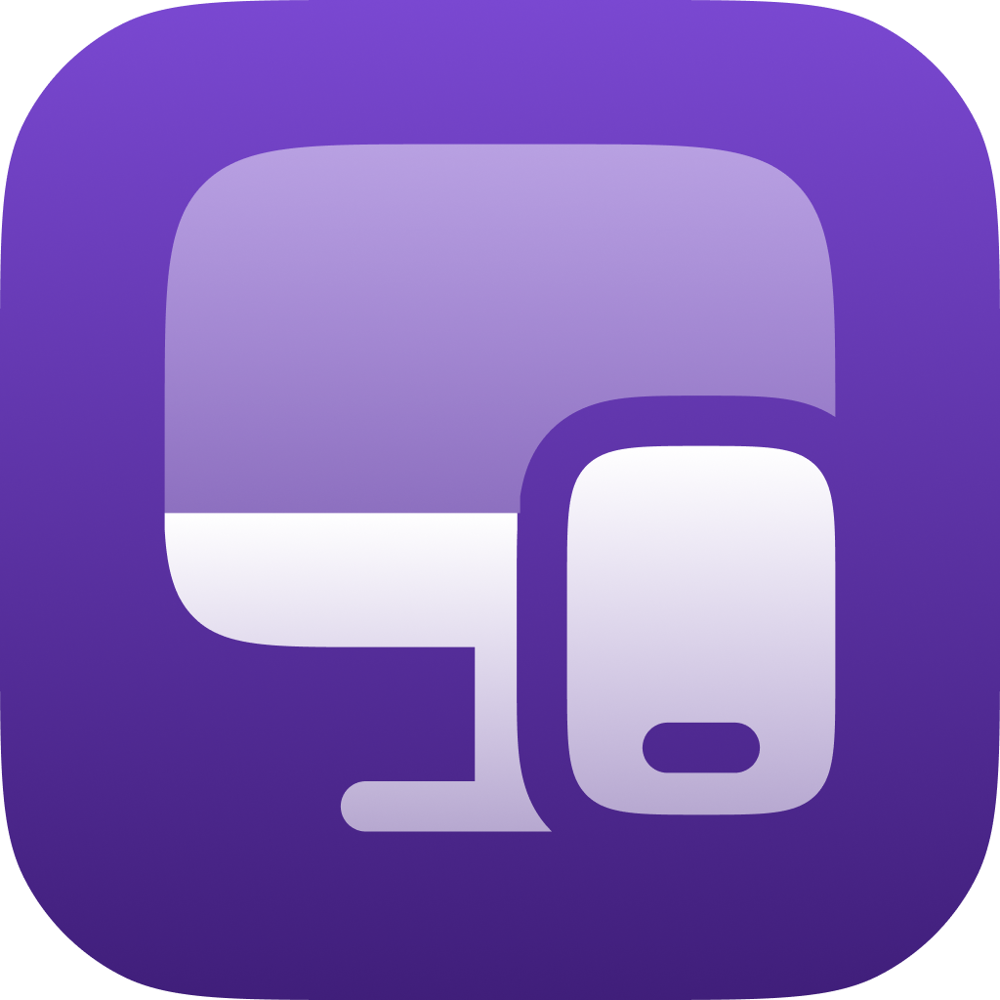

# AuraSync

AuraSync connects your Android to your PC or Mac for remote control, mirroring and real-time data exchange via USB or local network.

## 🚀 Features

Coming soon...

## 📦 Tech Stack

- **Frontend**: [Dart](https://dart.dev/)
- **Frontend**: [Flutter](https://flutter.dev/)

## 🧑‍💻 Contributing

🚫 This project is not accepting external contributions at the moment while core development is still in progress. Stay tuned for updates!

## 📄 License
This project is licensed under the AGPL-3.0 License. See [LICENSE](https://github.com/AuraSync/.github/blob/main/LICENSE) for more details.
